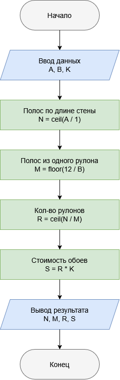

# Домашнее задание к работе 2

Алгоритм

1. **Начало**
2. Объявить константы: ROLL_LENGTH = 12 м (длина рулона), ROLL_WIDTH = 1 м (ширина рулона)
3. Задать исходные данные: A — длина стены (м), B — высота стены (м), K — цена одного рулона (руб.)
4. Вычислить, сколько полос шириной 1 м нужно, чтобы закрыть длину стены: N = ceil(A / ROLL_WIDTH)
5. Вычислить, сколько таких полос высотой B получится из одного рулона длиной 12 м: M = floor(ROLL_LENGTH / B)
6. Вычислить необходимое количество рулонов: R = ceil(N / M)
7. Вычислить итоговую стоимость: S = R * K
8. Вывести N, M, R, S
9. Конец
    ### Блок-схема
   
