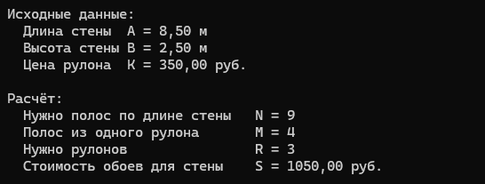

# Домашнее задание к работе 2
## Условие задачи
Хозяин хочет оклеить обоями длинную стену в своем доме. Длина этой стены равна А
м., а высота Б м. Рулон обоев имеет длину 12 м. и ширину 1 м. Сколько будут стоить
обои для всей стены, если цена одного рулона К руб.

Алгоритм

1. **Начало**
2. Объявить константы: LENGTH = 12 м (длина рулона), WIDTH = 1 м (ширина рулона)
3. Задать исходные данные: A — длина стены (м), B — высота стены (м), K — цена одного рулона (руб.)
4. Вычислить, сколько полос шириной 1 м нужно, чтобы закрыть длину стены: N = ceil(A / ROLL_WIDTH)
5. Вычислить, сколько таких полос высотой B получится из одного рулона длиной 12 м: M = floor(ROLL_LENGTH / B)
6. Вычислить необходимое количество рулонов: R = ceil(N / M)
7. Вычислить итоговую стоимость: S = R * K
8. Вывести N, M, R, S
9. Конец
    ### Блок-схема
   
## 2. Реализация программы
```
 #include <stdio.h>
 #include <math.h>
 #include <locale.h>
 int main() {
    setlocale(LC_ALL, "RUS");
    const double LENGTH = 12.0; 
    const double WIDTH = 1.0;  
    double A = 8.5;    
    double B = 2.5;    
    double K = 350.0; 

    int strips_needed = (int)ceil(A / WIDTH);
    int strips_per_roll = (int)floor(LENGTH / B);
    int rolls_needed = (int)ceil((double)strips_needed / strips_per_roll);
    double total_cost = rolls_needed * K;

    printf("Исходные данные:\n");
    printf("  Длина стены  A = %.2f м\n", A);
    printf("  Высота стены B = %.2f м\n", B);
    printf("  Цена рулона  K = %.2f руб.\n\n", K);

    printf("Расчёт:\n");
    printf("  Нужно полос по длине стены   N = %d\n", strips_needed);
    printf("  Полос из одного рулона       M = %d\n", strips_per_roll);
    printf("  Нужно рулонов                R = %d\n", rolls_needed);
    printf("  Стоимость обоев для стены    S = %.2f руб.\n", total_cost);

    return 0;
}
```
## 3. Результаты работы программы
  
## 4. Информация о разработчике
Баранов Антон БОТИ-262
